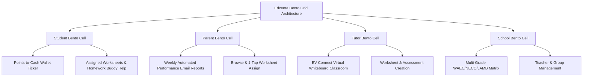

# Edcenta Design System — Bento Box Architecture (`DESIGN.md`)

> **Specification Standard:** Google Stitch `DESIGN.md` (v2.1)  
> **Design Methodology:** **Bento Box Grid System** (Solid, Tactile, Asymmetric Modular Compartments)  
> **Repository Scope:** Edcenta Educational Platform (`edcenta-fc` frontend, `edcenta-bc` backend)  
> **Core Mission:** Connect **Students**, **Parents**, **Tutors**, **Schools**, and **Homework Buddy Mentors** through curriculum-aligned worksheets (WAEC, NECO, JAMB, Primary/Secondary), live EV Connect virtual classrooms, automated parent email diagnostics, and points-to-cash rewards.  
> **Surface Aesthetic Rule:** Solid Bento Box compartments (`#FFFFFF` light, `#131C2E` dark) with crisp 1px structural borders (`#E2E8F0` / `#1E293B`), zero glassmorphism, and clear feature density.

---

## 1. Core Educational Pillars & Platform Features

Edcenta is built around 4 concrete platform pillars:

1. **Points-to-Cash Reward Engine:** Students earn **1 point per correct answer** (1,000 points = ₦500 cash equivalent). Minimum withdrawal threshold: 5,000 points (₦2,500).
2. **EV Connect Virtual Classroom:** Interactive whiteboard tools, class scheduling, one-on-one & group tutoring sessions, and screen sharing.
3. **Automated Performance Tracking & Parent Reports:** Real-time analytics tracking topic mastery (>70% strong topics, <70% topics needing practice) and automated weekly email summaries to parents.
4. **Homework Buddy Mentorship & National Curriculum Worksheets:** University student mentors providing remote homework help alongside structured WAEC, NECO, JAMB, and Primary 1-6 / JSS 1-3 / SSS 1-3 worksheets.

---

## 2. Bento Grid Layout & Persona Conversion Matrix



### Persona Compartment Specifications

| Persona Bento Cell | Core Platform Feature | Primary Visual Signature | Key Action Button |
| :--- | :--- | :--- | :--- |
| **Student Cell** | Points-to-Cash Wallet & Homework Buddy Help | **Cyan (`#00F2FE`) & Gold (`#FFB800`)** | `"Solve Worksheets & Earn Cash"` |
| **Parent Cell** | Weekly Email Reports & 1-Tap Activity Assign | **Emerald (`#059669`) & Indigo (`#4F46E5`)** | `"View Child Performance"` |
| **Tutor Cell** | EV Connect Classroom & Worksheet Management | **Violet (`#7C3AED`) & Obsidian (`#0F172A`)** | `"Launch Virtual Whiteboard"` |
| **School Cell** | Curriculum Grades & Institution Management | **Amber (`#D97706`) & Slate (`#1E293B`)** | `"Manage School Dashboard"` |

---

## 3. Color Architecture & Bento Tokens

### 3.1 Solid Surface System

```css
:root {
  /* Brand Constants */
  --color-brand-blue: #0075BC;
  --color-brand-emerald: #00AE9A;
  --color-brand-gold: #FFB800;
  --color-brand-purple: #8B53FF;

  /* Surface Light Tokens */
  --bg-app-light: #FAFAFA;
  --bg-bento-card-light: #FFFFFF;
  --bg-bento-subtle-light: #F1F5F9;
  --border-bento-light: #E2E8F0;
  --text-primary-light: #0F172A;
  --text-secondary-light: #475569;

  /* Surface Dark Tokens */
  --bg-app-dark: #0B0F17;
  --bg-bento-card-dark: #131C2E;
  --bg-bento-subtle-dark: #1E293B;
  --border-bento-dark: #1E293B;
  --text-primary-dark: #F8FAFC;
  --text-secondary-dark: #94A3B8;
}
```

---

## 4. Typography & Educational Readability

1. **Primary Interface (`font-sans`):** `Plus Jakarta Sans`, sans-serif.
2. **Display Headlines (`font-display`):** `Outfit`, `Plus Jakarta Sans`, sans-serif.
3. **Monospace / Points (`font-mono`):** `JetBrains Mono`, monospace (Points counter, math formulas, question IDs).

---

## 5. Do's and Don'ts

### ✅ DO:
1. **Highlight real Edcenta features:** Points-to-Cash, EV Connect Whiteboard, Automated Parent Email Summaries, Homework Buddy Mentors, and WAEC/NECO/JAMB Worksheets.
2. **Display clear economic context** for points (1,000 pts = ₦500 cash).
3. **Use solid Bento surfaces** (`#FFFFFF` light, `#131C2E` dark) with crisp 1px structural borders.

### ❌ DON'T:
1. **DON'T EVER render internal design system jargon or developer methodology tags** (e.g., "Bento Box Grid Architecture" or "Stitch DESIGN.md") in user-facing UI copy, badges, or headlines. Headlines must always be clean, natural customer product copy.
2. **DON'T claim AI-generated activities or AI features that are not built.** Frame the platform around real interactive tools, tutor co-working, parent analytics, and student rewards.
3. **DON'T use glassmorphism or backdrop blurs.**
4. **DON'T allow text copying or screenshots on exam worksheets.**
5. **DON'T use dummy hardcoded arrays for pricing or subscriptions.** Fetch live plan data from the server.

---
*Created for Edcenta Platform Specification under Google Stitch DESIGN.md Standard (v2.2).*
