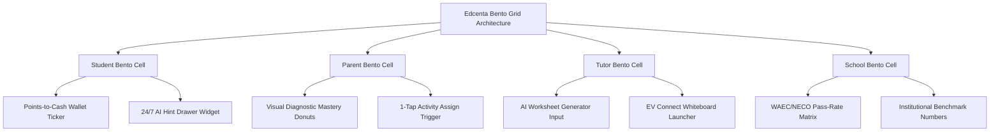

# Edcenta Design System — Bento Box Architecture (`DESIGN.md`)

> **Specification Standard:** Google Stitch `DESIGN.md` (v2.0)  
> **Design Methodology:** **Bento Box Grid System** (Solid, Tactile, Asymmetric Modular Compartments)  
> **Repository Scope:** Edcenta Educational Platform (`edcenta-fc` frontend, `edcenta-bc` backend)  
> **Core Objective:** Position Edcenta as the premier **Human-In-The-Loop AI Acceleration Ecosystem** converting **Students**, **Parents**, **Tutors**, and **Schools** across WAEC, NECO, JAMB, and Primary/Secondary curricula.  
> **Surface Aesthetic Rule:** Solid Bento Box compartments (`#FFFFFF` light, `#131C2E` dark) with crisp 1px structural borders (`#E2E8F0` / `#1E293B`), zero glassmorphism, and distinct visual density per card.

---

## 1. Why Bento Box Design Fits Edcenta Perfectly

Edcenta is a multi-persona platform combining distinct features:
- **Points-to-Cash Reward Engine** (Live wallet counter).
- **24/7 AI Homework Buddy** (Socratic hint drawer).
- **EV Connect Virtual Classroom** (Interactive whiteboard).
- **Automated Weekly Parent Diagnostics** (Subject mastery charts).
- **School Multi-Tenant Dashboard** (WAEC/NECO pass-rate matrix).

**The Bento Box design language organizes these heterogeneous elements into beautiful, asymmetric, self-contained compartments.** Each feature lives in its own high-contrast, rounded rectangular Bento cell, giving visitors an instant visual breakdown of Edcenta’s super-powers without screen clutter.

---

## 2. Bento Grid Layout & Persona Conversion Matrix



### Bento Compartment Specifications per Persona

| Persona Bento Cell | Grid Span (Desktop) | Solid Surface Token | Visual Accent Signature | Core Bento Widget |
| :--- | :--- | :--- | :--- | :--- |
| **Student Bento** | 2-Column Wide Span (`col-span-8`) | `#FFFFFF` (Light) / `#131C2E` (Dark) | **Electric Cyan (`#00F2FE`) & Gold (`#FFB800`)** | Live Points-to-Cash Ticker (`⭐ 3,450 Pts = ₦1,725 Cash`) + AI Socratic Hint Box. |
| **Parent Bento** | 1-Column Tall Span (`col-span-4`) | `#FFFFFF` (Light) / `#131C2E` (Dark) | **Emerald Green (`#059669`) & Indigo (`#4F46E5`)** | Subject Mastery Progress Bars + `"⚡ 1-Tap Remedial Assign"` trigger. |
| **Tutor Bento** | 1-Column Span (`col-span-6`) | `#FFFFFF` (Light) / `#131C2E` (Dark) | **Electric Violet (`#7C3AED`) & Obsidian (`#0F172A`)** | Instant AI Worksheet Generator input + EV Connect whiteboard status. |
| **School Bento** | 1-Column Span (`col-span-6`) | `#FFFFFF` (Light) / `#131C2E` (Dark) | **Royal Amber (`#D97706`) & Slate (`#1E293B`)** | Institutional WAEC / NECO / JAMB compliance matrix & student metrics. |

---

## 3. Color Architecture & Bento Tokens

### 3.1 Solid Bento Surface System

```css
:root {
  /* Brand Constants */
  --color-brand-blue: #0075BC;
  --color-brand-emerald: #00AE9A;
  --color-brand-gold: #FFB800;
  --color-brand-violet: #7C3AED;

  /* Light Bento Surfaces */
  --bg-app-light: #F8FAFC;
  --bg-bento-card-light: #FFFFFF;
  --bg-bento-subtle-light: #F1F5F9;
  --border-bento-light: #E2E8F0;
  --border-bento-strong-light: #CBD5E1;
  --text-primary-light: #0F172A;
  --text-secondary-light: #475569;

  /* Dark Bento Surfaces */
  --bg-app-dark: #0B0F17;
  --bg-bento-card-dark: #131C2E;
  --bg-bento-subtle-dark: #1E293B;
  --border-bento-dark: #1E293B;
  --border-bento-strong-dark: #334155;
  --text-primary-dark: #F8FAFC;
  --text-secondary-dark: #94A3B8;
}
```

### 3.2 Bento Cell Role Signatures

- **Student Cell:** Accent Cyan `#00F2FE` & Gold `#FFB800` | Badge bg `#E0F2FE`, text `#0369A1`
- **Parent Cell:** Accent Emerald `#059669` & Indigo `#4F46E5` | Badge bg `#D1FAE5`, text `#047857`
- **Tutor Cell:** Accent Violet `#7C3AED` & Obsidian `#0F172A` | Badge bg `#F3E8FF`, text `#6D28D9`
- **School Cell:** Accent Amber `#D97706` & Slate `#1E293B` | Badge bg `#FEF3C7`, text `#B45309`

---

## 4. Typography & Bento Hierarchy

### 4.1 Font Family Pairings
1. **Primary Interface (`font-sans`):** `Plus Jakarta Sans`, sans-serif.
2. **Display Headlines (`font-display`):** `Outfit`, `Plus Jakarta Sans`, sans-serif.
3. **Monospace / Exam IDs (`font-mono`):** `JetBrains Mono`, monospace (Points counter, math formulas, question IDs).

### 4.2 Type Hierarchy Table

| Token | Size | Line Height | Weight | Bento Usage |
| :--- | :--- | :--- | :--- | :--- |
| `display-2xl` | `3.75rem` (60px) | 1.12 | 800 (ExtraBold) | Hero main conversion headline |
| `display-xl` | `3.00rem` (48px) | 1.15 | 700 (Bold) | Bento Grid Section Title |
| `heading-lg` | `2.25rem` (36px) | 1.20 | 700 (Bold) | Main Bento Cell Title |
| `heading-md` | `1.50rem` (24px) | 1.30 | 600 (SemiBold) | Widget card header |
| `heading-sm` | `1.25rem` (20px) | 1.35 | 600 (SemiBold) | Inner Bento compartment header |
| `body-base` | `1.00rem` (16px) | 1.50 | 400 (Regular) | Primary description text |
| `caption` | `0.75rem` (12px) | 1.30 | 500 (Medium) | AI status badge pill (`[AI Augmented]`) |

---

## 5. Bento Spatial Grid & Cell Radii

### 5.1 Bento Geometry
- **Cell Corner Radius:** `1.5rem` (`24px` / `rounded-2xl`).
- **Inner Widget Radius:** `1.0rem` (`16px` / `rounded-xl`).
- **Grid Gap:** `1.5rem` (`24px`).
- **Cell Padding:** `2.0rem` (`32px`).

### 5.2 Responsive Bento Breakpoints
- **Mobile (`<768px`):** Single-column stacked Bento cells (`grid-cols-1`).
- **Tablet (`768px - 1024px`):** 2-column Bento grid (`grid-cols-2`).
- **Desktop (`>1024px`):** 12-column asymmetric Bento grid (`grid-cols-12`).

---

## 6. Component Blueprints in Bento Cells

### 6.1 Student Bento Compartment (Points-to-Cash + AI Hint)

```tsx
// Student Bento Blueprint Representation
<div className="col-span-12 lg:col-span-8 p-8 rounded-2xl bg-white border border-slate-200 shadow-sm flex flex-col justify-between">
  <div className="flex justify-between items-center mb-6">
    <span className="px-3 py-1 rounded-full text-xs font-bold bg-cyan-100 text-cyan-800">
      🎓 Student Hub
    </span>
    <div className="px-4 py-1.5 rounded-full bg-amber-50 border border-amber-300 flex items-center gap-2">
      <span className="font-mono text-xs font-bold text-amber-900">⭐ 3,450 Pts (₦1,725 Cash)</span>
    </div>
  </div>

  <h3 className="text-2xl font-bold text-slate-900 mb-2">Earn Cash While Mastering WAEC & JAMB Subjects</h3>
  <p className="text-sm text-slate-600 mb-6">Solve practice worksheets, get non-judgmental AI hints, and redeem points straight into your e-wallet.</p>

  <div className="p-4 rounded-xl bg-purple-50 border border-purple-200 space-y-2">
    <div className="flex items-center gap-2 text-xs font-bold text-purple-900">
      <span className="px-2 py-0.5 rounded bg-purple-200 text-purple-800 text-[10px]">AI Augmented</span>
      <span>24/7 AI Homework Buddy</span>
    </div>
    <p className="text-xs text-slate-700">💡 <strong>Hint:</strong> Solve <code>2x + 5 = 15</code> by subtracting 5 first to isolate <code>2x</code>!</p>
  </div>
</div>
```

### 6.2 Parent Bento Compartment (Automated Diagnostics)

```tsx
// Parent Bento Blueprint Representation
<div className="col-span-12 lg:col-span-4 p-8 rounded-2xl bg-white border border-slate-200 shadow-sm flex flex-col justify-between">
  <div className="flex justify-between items-center mb-4">
    <span className="px-3 py-1 rounded-full text-xs font-bold bg-emerald-100 text-emerald-800">
      👨‍👩‍👧 Parent Oversight
    </span>
    <span className="text-xs text-emerald-600 font-bold">Active Summary</span>
  </div>

  <h3 className="text-xl font-bold text-slate-900 mb-4">Weekly AI Performance Reports</h3>
  
  <div className="space-y-3 mb-6">
    <div>
      <div className="flex justify-between text-xs font-bold mb-1">
        <span>Mathematics (WAEC)</span>
        <span className="text-emerald-600">88%</span>
      </div>
      <div className="w-full h-2 bg-slate-100 rounded-full overflow-hidden">
        <div className="h-full bg-emerald-500 rounded-full" style={{ width: '88%' }} />
      </div>
    </div>
  </div>

  <button className="w-full py-2.5 bg-emerald-600 text-white rounded-xl text-xs font-bold hover:bg-emerald-700">
    ⚡ 1-Tap Assign Remedial Worksheet
  </button>
</div>
```

---

## 7. Do's and Don'ts for Bento Design

### ✅ DO:
1. **Use Bento Box asymmetric grids** (`col-span-8` + `col-span-4`, `col-span-6` + `col-span-6`) to present features clearly.
2. **Keep Bento surfaces solid and opaque** (`#FFFFFF` light, `#131C2E` dark) with crisp 1px borders (`#E2E8F0` / `#1E293B`).
3. **Use persona-specific accent colors** within each Bento compartment.
4. **Display clear cash equivalents (₦ Naira)** for student point totals.
5. **Ensure responsive stacking** on mobile (`grid-cols-1`).

### ❌ DON'T:
1. **STRICTLY NO GLASSMORPHISM OR BACKDROP BLURS.** Surfaces must be solid.
2. **DON'T create uniform repetitive 3-column cards** — vary Bento cell spans for visual rhythm.
3. **DON'T overcrowd individual Bento cells** — keep 1 key interactive widget per cell.

---
*Created for Edcenta Platform Specification under Google Stitch DESIGN.md Standard (v2.0 - Bento Box Architecture).*
