# EdCenta Models: Current vs. Needed

## 📊 Current Models vs. Required Models

```mermaid
graph LR
    subgraph "✅ CURRENT MODELS"
        U[User]
        ST[Student]
        SUBJ[Subject]
        TOPIC[Topic]
        WS[WorkSheet]
        Q[Question]
        ASSESS[Assessment]
        ASS_ATT[Assessment Attempt]
        ASSIGN[Assignment]
        W[Wallet]
        TR[Transaction]
        SUB[Subscription]
        PLAN[Plan]
        SG[School Grade]
    end

    subgraph "❌ MISSING MODELS"
        VC[Virtual Class]
        CS[Class Schedule]
        SP[Student Points]
        RC[Reward Config]
        MSG[Message]
        NOTIF[Notification]
        AR[Automated Report]
        PA[Performance Analytics]
        REF[Referral]
        AL[Access Link]
        EB[Exam Board]
        EL[E-Library]
        PERM[Permissions]
        ALG[Activity Log]
    end

    subgraph "🔄 ENHANCED MODELS"
        U_ENH[User + Permissions]
        WS_ENH[WorkSheet + Protection]
        Q_ENH[Question + Analytics]
        ST_ENH[Student + Points]
    end
```



## 🎯 Critical Missing Components

### **1. Points-to-Cash System (Core Business Model)**
```
Current: Student → Question → Assignment
Missing: Student → Question → Points → Wallet → Cash
```

### **2. Virtual Classroom (Major Feature)**
```
Current: No virtual class support
Missing: Tutor → Virtual Class → Students → Whiteboard → Recording
```

### **3. Communication System (User Interaction)**
```
Current: No messaging system
Missing: User ↔ Message ↔ Recipient
```

### **4. Analytics & Reporting (Parent Engagement)**
```
Current: Basic assignment tracking
Missing: Performance Analytics → Automated Reports → Parents
```

## 📈 Implementation Impact

### **High Impact Missing Models:**
1. **Student Points** - Core business model
2. **Virtual Class** - Major feature differentiator
3. **Message System** - User engagement
4. **Performance Analytics** - Parent satisfaction

### **Medium Impact Missing Models:**
5. **Reward Config** - Business flexibility
6. **Automated Reports** - User retention
7. **Exam Board** - Content organization
8. **Permissions** - Security

### **Low Impact Missing Models:**
9. **Referral System** - Growth feature
10. **E-Library** - Content enhancement
11. **Activity Log** - Audit trail
12. **Access Links** - Sharing feature

## 🚨 Immediate Action Required

Your current models cover only **~40%** of the required functionality. The most critical gaps are:

1. **Points-to-Cash System** (60% of business model)
2. **Virtual Classroom** (Major feature)
3. **Communication System** (User interaction)
4. **Enhanced User Management** (Security)

## 💡 Recommended Implementation Order

### **Phase 1 (Critical for Launch)**
```
Week 1-2: Student Points + Reward Config
Week 3-4: Message System + Notifications
Week 5-6: Enhanced User Model + Permissions
```

### **Phase 2 (Important Features)**
```
Week 7-8: Virtual Class + Class Schedule
Week 9-10: Performance Analytics + Automated Reports
Week 11-12: Exam Board + Curriculum Standards
```

### **Phase 3 (Advanced Features)**
```
Week 13-14: Referral System + E-Library
Week 15-16: Activity Logs + Access Links
Week 17-18: Content Protection + Advanced Analytics
```

## 🔧 Technical Considerations

### **Database Changes Needed:**
- **New Collections**: 12+ new models
- **Enhanced Collections**: 4 existing models need major updates
- **Indexes**: 20+ new indexes for performance
- **Relationships**: 30+ new foreign key relationships

### **API Changes Needed:**
- **New Endpoints**: 50+ new GraphQL resolvers
- **Enhanced Endpoints**: 20+ existing endpoints need updates
- **Real-time Features**: WebSocket support for virtual classes
- **File Handling**: Enhanced file upload/download system

### **Frontend Changes Needed:**
- **New Pages**: 15+ new pages for missing features
- **Enhanced Pages**: 10+ existing pages need updates
- **Real-time UI**: Live updates for virtual classes and messaging
- **Mobile Support**: Responsive design for all new features

## 📋 Next Steps

1. **Start with Student Points** - Core business functionality
2. **Add Message System** - User engagement
3. **Enhance User Model** - Security foundation
4. **Implement Virtual Class** - Major feature
5. **Add Analytics** - Parent satisfaction

Would you like me to start implementing the **Student Points system** first? It's the foundation of your business model and will immediately improve user engagement.
