# EdCenta Platform - System Architecture Diagram

## 🏗️ Complete System Architecture

```mermaid
graph TB
    %% User Management Layer
    subgraph "👥 User Management"
        SA[Super Admin]
        A[Admin]
        M[Moderator]
        S[School]
        T[Tutor]
        P[Parent]
        ST[Student]
        HB[Homework Buddy]
        
        SA --> A
        A --> M
        S --> T
        P --> ST
        T --> ST
        HB --> ST
    end

    %% Core User Models
    subgraph "👤 User Models"
        U[User Model]
        ST_MODEL[Student Model]
        W[Wallet Model]
        SUB[Subscription Model]
        PLAN[Plan Model]
        
        U --> ST_MODEL
        U --> W
        U --> SUB
        SUB --> PLAN
    end

    %% Educational Content Layer
    subgraph "📚 Educational Content"
        SG[School Grade]
        SUBJ[Subject]
        TOPIC[Topic]
        SUBTOPIC[SubTopic]
        WS[WorkSheet]
        Q[Question]
        ASSESS[Assessment]
        ASS_ATT[Assessment Attempt]
        
        SG --> SUBJ
        SUBJ --> TOPIC
        TOPIC --> SUBTOPIC
        TOPIC --> WS
        WS --> Q
        TOPIC --> ASSESS
        ASSESS --> ASS_ATT
    end

    %% Virtual Classroom Layer
    subgraph "🎓 Virtual Classroom (EV Connect)"
        VC[Virtual Class]
        CS[Class Schedule]
        WB[Whiteboard]
        SR[Screen Recording]
        VQ[Virtual Quiz]
        
        T --> VC
        VC --> CS
        VC --> WB
        VC --> SR
        VC --> VQ
        VQ --> ASSESS
    end

    %% Points & Rewards System
    subgraph "💰 Points & Rewards"
        RC[Reward Config]
        SP[Student Points]
        TR[Transaction]
        WT[Wallet Transaction]
        
        Q --> SP
        ASS_ATT --> SP
        SP --> RC
        SP --> TR
        TR --> WT
        WT --> W
    end

    %% Communication System
    subgraph "💬 Communication"
        MSG[Message]
        NOTIF[Notification]
        AR[Automated Report]
        CHAT[Chat Support]
        
        U --> MSG
        U --> NOTIF
        AR --> P
        AR --> T
        AR --> S
        CHAT --> U
    end

    %% Analytics & Performance
    subgraph "📊 Analytics & Performance"
        PA[Performance Analytics]
        SA[Student Analytics]
        GR[Grades Summary]
        ASSIGN[Assignment]
        
        ASS_ATT --> PA
        ASSIGN --> PA
        PA --> SA
        SA --> GR
        GR --> AR
    end

    %% Business Features
    subgraph "🏢 Business Features"
        REF[Referral]
        STIER[Subscription Tier]
        AL[Access Link]
        ALG[Activity Log]
        
        U --> REF
        U --> STIER
        U --> AL
        U --> ALG
    end

    %% Content Management
    subgraph "📝 Content Management"
        EB[Exam Board]
        CS[Curriculum Standard]
        EL[E-Library]
        CV[Content Version]
        
        SUBJ --> EB
        EB --> CS
        WS --> EL
        WS --> CV
        Q --> CV
    end

    %% Security & Access
    subgraph "🔒 Security & Access"
        PERM[Permissions]
        AUTH[Authentication]
        PROT[Content Protection]
        ALG2[Activity Log]
        
        U --> PERM
        U --> AUTH
        WS --> PROT
        U --> ALG2
    end

    %% Connections between major systems
    ST --> ASSIGN
    ASSIGN --> WS
    ST --> ASS_ATT
    T --> ASSIGN
    P --> ASSIGN
    S --> ASSIGN
    
    ST --> SP
    SP --> TR
    TR --> W
    
    VC --> ST
    VC --> T
    VC --> S
    
    MSG --> U
    NOTIF --> U
    AR --> U
    
    PA --> ST
    SA --> ST
    GR --> ST
    
    REF --> U
    AL --> U
    ALG --> U
    
    EB --> SUBJ
    CS --> TOPIC
    EL --> WS
    
    PERM --> U
    AUTH --> U
    PROT --> WS
```



## 🔄 Data Flow Relationships

### 1. **Student Learning Flow**
```
Student → Assignment → Worksheet → Questions → Points → Wallet
     ↓
Assessment → Assessment Attempt → Performance Analytics → Automated Reports
```

### 2. **Content Creation Flow**
```
Super Admin → Subject → Topic → Worksheet → Questions
     ↓
Exam Board → Curriculum Standards → Content Protection
```

### 3. **Virtual Classroom Flow**
```
Tutor → Virtual Class → Class Schedule → Students
     ↓
Whiteboard → Screen Recording → Virtual Quiz → Assessment
```

### 4. **Communication Flow**
```
User → Message → Recipient
     ↓
Performance Analytics → Automated Report → Parent/Tutor/School
```

### 5. **Business Flow**
```
User → Referral → New User → Subscription → Plan
     ↓
Points → Transaction → Wallet → Withdrawal
```

## 📊 Key Relationships Summary

### **User Hierarchy**
- **Super Admin** → Manages all users and content
- **Admin/Moderator** → Manages specific areas
- **School** → Manages tutors and students
- **Tutor** → Teaches students, creates content
- **Parent** → Monitors student progress
- **Student** → Learns, earns points, takes assessments
- **Homework Buddy** → Provides additional support

### **Content Hierarchy**
- **School Grade** → **Subject** → **Topic** → **SubTopic**
- **Topic** → **Worksheet** → **Questions**
- **Topic** → **Assessment** → **Assessment Attempt**

### **Financial Flow**
- **Questions/Assessments** → **Points** → **Student Points**
- **Student Points** → **Transactions** → **Wallet**
- **Wallet** → **Withdrawals** → **Cash**

### **Communication Flow**
- **All Users** ↔ **Messages**
- **Performance Data** → **Automated Reports** → **Parents/Tutors**
- **System** → **Notifications** → **Users**

### **Security & Access**
- **User** → **Permissions** → **Access Control**
- **Content** → **Protection** → **Secure Access**
- **Activities** → **Logging** → **Audit Trail**

## 🎯 System Integration Points

### **Critical Integration Points:**
1. **User Authentication** → **Role-based Access** → **Permissions**
2. **Content Creation** → **Exam Board Standards** → **Curriculum Alignment**
3. **Student Performance** → **Analytics Engine** → **Automated Reporting**
4. **Points System** → **Transaction Processing** → **Wallet Management**
5. **Virtual Classroom** → **Real-time Communication** → **Content Delivery**

### **Data Dependencies:**
- **Student** depends on **User**, **School Grade**, **Parent/Tutor**
- **Worksheet** depends on **Subject**, **Topic**, **Exam Board**
- **Assessment** depends on **Questions**, **Topic**, **Student**
- **Points** depend on **Student**, **Questions**, **Assessment Attempts**
- **Virtual Class** depends on **Tutor**, **Students**, **Schedule**

This architecture ensures:
- ✅ **Scalability** - Modular design allows easy expansion
- ✅ **Security** - Role-based access control throughout
- ✅ **Performance** - Optimized data relationships
- ✅ **Maintainability** - Clear separation of concerns
- ✅ **Flexibility** - Easy to add new features and user types
